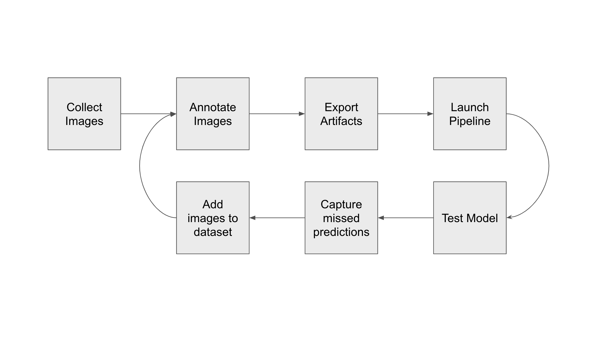

# flyingthings
## Computer vision demo
This workshop is designed to showcase OpenShift as a platform for developing and operationalizing AI/ML applications. It uses many tools in the Red Hat ecosystem as well as 3rd party applications and services. This particular workshop features a computer vision implementation and covers a workflow for custom training and serving for integration with other applications and services.


# Workshop Components

## OpenShift
OpenShift is the foundation of everything we’re using today. Its ability to securely run containerized workloads makes it ideal for our purposes. Since the nature of Data Science is experimentation and many many iterations, its ability to consistently deploy and maintain multiple environments and configurations makes it a great foundation for ML Operations.

## Red Hat OpenShift Pipelines
OpenShift Pipelines is the engine that drives our operation. All of the elements and tasks that make up our workflow have been automated and are managed by Tekton. As it’s a Kubernetes native CI tool, it helps establish workflows that ensure consistent results with the flexibility to extend capabilities at any time.

## Minio
Minio is an S3 compatible open source object storage service we’ll be using to store our artifacts. It's lightweight and easily deployed to Openshift.

## Yolo
Yolo is written in Python so the workshop is mostly coded in Python. We’ll be using Python 3.9 so feel free to poke around in the code for anything useful.

## FastAPI
For basic model serving we’ll be using FastAPI. It’s lightweight and fairly simple to deploy with our model and it has an excellent SWAGGER interface which comes in handy for testing our model and even serving it to other applications and services.

## Label Studio
And finally there’s LabelStudio. LabelStudio is an annotation tool used to label datasets for input into AI/ML system training. We’ll be using it to collect and label our image datasets.

# Workflow

## Collect images
Ideally gather many images of all objects we want to detect from different angles and lighting conditions.

## Annotate images
Annotation is the process of identifying objects in an image and drawing bounding boxes around them. Each image could have multiple different or same objects so the more thorough you are in labeling the more accurate your model will predict.

## Export Artifacts
Once annotation is complete, we export the images, annotations, and classes in a format Yolo can use for training. This is stored in our object storage.

## Launch Pipeline
We give our pipeline parameters like the name of our model, where the annotation export is, and what values to use during the training. Once the training is complete the pipeline stores artifacts from the session as well as additional export formats of the model so it can be consumed by a host of other model servers. The artifacts are again stored in our object storage.

## Test Model
Since our model was deployed with a FastAPI application we can easily test it with the swagger interface. 

## Capture missed predictions
During the testing portion it is important to test on images that were not part of the dataset. This will reveal any precision issues with the model. Missed or low confidence predictions can be collected and input back into the pipeline. 

## Add images to dataset
We can collect all the missed images and add them to LabelStudio where they will now be part of that dataset going forward.

## Repeat
We then annotate, as before, and repeat the process until we have acceptable confidence levels in our predictions.


# Prerequisites
- An OpenShift cluster at version 4.13 or greater.
    - Single Node Openshift with at least 32GB RAM will be adequate
    - GPU Enabled Node (Optional)
    - OCP internal registry
    - OpenShift Pipelines Operator
    - Dynamic Storage Provisioning (ODF, LVM Storage, etc)
    - Cluster Admin
- Workstation with terminal (RHEL or Centos Streams with bash or zsh)
    - Git client
    - Tekton client
- Optional
    - Still camera
    - Webcam

# Getting Started
1. Login to your cluster from your workstation.
2. Clone the repository to your workstation. 
```
git clone https://github.com/davwhite/flyingthings.git
```
3. Go to the directory flyingthings/bootstrap and run script 01-create-pipelines.sh with the name of the project where you will be deploying the workshop. 
```
cd flyingthings/bootstrap
./01-create-pipelines.sh <yourproject>
```
4. Run script 02-build-images-tkn.sh with the same project used for the previous step.
```
./02-build-images-tkn.sh <yourproject>
```

This process will take some time as the images for the workshop are created. Allow 10 to 30 minutes to complete.

